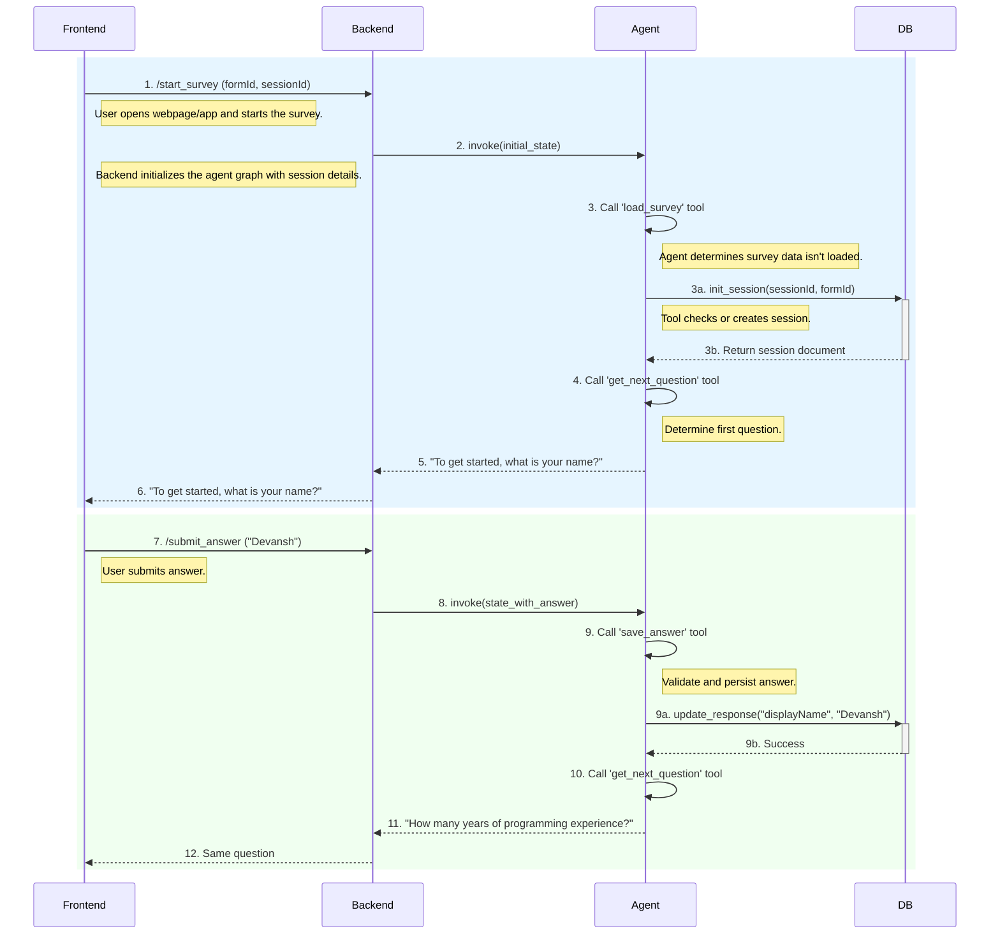

```mermaid
sequenceDiagram
    participant Frontend
    participant Backend
    participant Agent
    participant DB

    %% --- Turn 1: Initialization and First Question ---
    rect rgb(230, 245, 255)
        Frontend->>Backend: 1. /start_survey (formId, sessionId)
        note right of Frontend: User opens webpage/app and starts the survey.

        Backend->>Agent: 2. invoke(initial_state)
        note left of Backend: Backend initializes the agent graph with session details.

        Agent->>Agent: 3. Call 'load_survey' tool
        note right of Agent: Agent determines survey data isn't loaded.

        Agent->>+DB: 3a. init_session(sessionId, formId)
        note right of Agent: Tool checks or creates session.
        DB-->>-Agent: 3b. Return session document

        Agent->>Agent: 4. Call 'get_next_question' tool
        note right of Agent: Determine first question.

        Agent-->>Backend: 5. "To get started, what is your name?"
        Backend-->>Frontend: 6. "To get started, what is your name?"
    end

    %% --- Turn 2: User Answers and Next Question ---
    rect rgb(240, 255, 240)
        Frontend->>Backend: 7. /submit_answer ("Devansh")
        note right of Frontend: User submits answer.

        Backend->>Agent: 8. invoke(state_with_answer)

        Agent->>Agent: 9. Call 'save_answer' tool
        note right of Agent: Validate and persist answer.

        Agent->>+DB: 9a. update_response("displayName", "Devansh")
        DB-->>-Agent: 9b. Success

        Agent->>Agent: 10. Call 'get_next_question' tool

        Agent-->>Backend: 11. "How many years of programming experience?"
        Backend-->>Frontend: 12. Same question
    end


```
